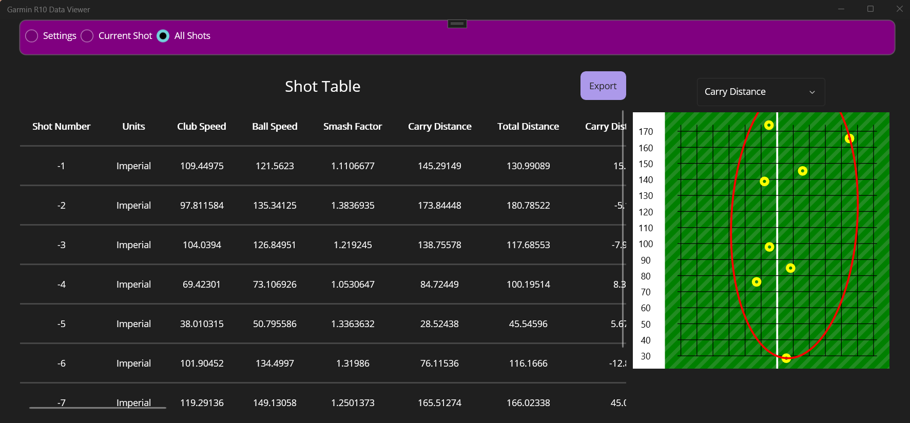

# Garmin R10 Data Viewer

**Experimental**

This project is an experiment I created a while back and decided to make open source as others might find it interesting. 

The goal was to create app that can directly connect to the Garmin R10 golf launch monitor, experiment with enriching and visualing the data. This is a minimum viable project to experiment with some ideas and aid in the future creation of simple golf simulation apps, games, and tools.

I developed this as a .NET Maui application with the idea that it could be made to work across Windows, Mac, iOS and Android. 

Many launch montitors like the Garmin R10 do not provide insights on the carry distance, total distance, max height, etc. as these are generally calculated by the simulation software level, not at the device level. 
As an initial experiment I created machine learning models to calculate many of these values. 

I've also included an export button for the data that saves the data as a CSV file using the same format as Awesome Golf. I chose this format after discussing the idea with the creator of [Golf Shot Analytics](https://www.golfshotanalytics.com/) and they recommended this format due to it's simplicity.  And yes, you should be able to take the data exported from this project and use it with Golf Shot Analytics.

Note: In the table view, for shot numbers, "test" shots are given negative numbers while shots made via the launch monitor will have positive numbers. 

## Challenges and learnings

This is an experimental project mainly for my own learnings. 

- Device monitor connections: Directly connecting to the R10 is a challenge across multiple platforms unofficially is challenging. I started off by porting over code from [gsp-r10-adapter](https://github.com/mholow/gsp-r10-adapter) which is a desktop app that directly connection to the R10 and sends the data through the Open Connect API for use with GSPro. It also includes a method to piggy back on "E6 connect" as another method to capture the R10 data. The bluetooth and Protobuf libraries in this project only works on Windows. I did start porting the Bluetooth library that works in .NET Maui for cross platform support and had it some what working in Android, however without the Protobuf library ported yet this project doesn't work outside of Windows. My current thinking is to abandon the idea of creating direct connections to launch monitors. If I wanted to extend this project to support all other launch monitors that amount of work to do so would grow significantly. For now I'm thinking about forgetting about cross platform and focusing on creating a light weight Windows app instead that leverages the Open Connect API and the various existing libraries/apps that are out there for that part. At the end of the day I'm more interested in creating fun apps to get more out of my launch monitor than rewriting/porting a bunch of libraries to work in .NET Maui across multiple platforms. I did play around with the idea of creating a single .NET Maui library has the ability to connect to as many different launch monitor types as possible. I think that would be valuable to a lot of app developers, however, I could also see many launch monitor companies being against this as it appears they want to have control over which apps can connect to their devices and get a cut of the profits. I personally feel that I bought my launch monitor and should be able to do with it as I please when using it locally. I don't have to go through the app store of my computer or phone to install apps if I don't want to. In fact these companies are required to allow 3rd party app stores. That said, this project isn't about "sticking it to the man", but to gain more value from the launch monitor I purchased.
- Machine learning model accuracy: To calculate the carry distance, total distance, max height, etc. I created machine learning models to predict these values based on the data captured by the R10. I managed to get the models to be decently accurate with most values having an R2 for most models being 0.95 or higher. However, the models are not perfect and there are some outliers that are not accurate. However I also found that when it comes to rendering the data we are left with approximating curves and don't have much flexibility to impact the data with external factors such as wind speed and elevation for use in golf simulation apps. In another project I wrote a physics engine that calculates the positions of a ball every 0.01 seconds of it's flight path which allows a lot more flexibility for rendering and simulation. I also found that the accuracy on key metrics such as carry distance was better with the physics based calculation verses the machine learning model approach for these metrics. This physics engine is not included in this project at this time as it is written in another programmign language and needs some cleanup, but I may include it in the future.
- Rendering: I have grand visions for creating fun apps with the data captured, but for this project I kept things simple and use based 2D rendering graphics to show the shot path, and to also cluster the shots by carry or total distance with an ellipse. In another app I've been experimenting with I'm actually leveraging a web view control and doing the rendering with WebGL with more advance graphic libraries. Ultimately my goal is to create a light weight app with rich graphics that doesn't require a powerful gaming computer to run. GS Pro is awesome, but a common sentiment I've seen with those new to creating home golf simulator, aside from pretty much all the apps being relatively expensive (and almost always subscription based), the cost of a gaming computer can significantly increase the inital costs, sometimes doubling the costs when someone is trying to do a budget build. Whike creating this project I also helped develop a [Hybrid WebView control for .NET Maui](https://github.com/Eilon/MauiHybridWebView) which has since been adopted by Microsoft and is [built into .NET Maui 9 and above](https://learn.microsoft.com/en-us/dotnet/maui/user-interface/controls/hybridwebview?view=net-maui-9.0).
- .NET Framework: .NET Maui provides the benifit for working across multiple platforms, however, there is limited support for it compared to other .NET Frameworks such as WinUI and WPF. I constantly found myself digging around the web to find open source libraries that filled gaps. For example; there is not native control for showing a table of data in .NET Maui. 

## Captured Launch Monitor Metrics

The Garmin R10 provides a decent amount of data, however there were a few additional metrics that I wanted to capture which could be calculated. Here are all the data fields I attempt to capture/calculate:

| Launch Monitor Metric | Captured method | Notes |
| --- | --- | --- |
| Player Handed | User input | |
| Units | User input | Units of measured data. Metric or imperial. Distances in meters of yards, heights/altitude in meters or feet, speed in m/s or mph. |
| Date | Calculated | Added by library when shot captured. | 
| Altitude| User input |  |
| Club| User input |  |
| Shot Number | From device | |
| Club type | User input | |
| Club Description | N/A | Not currently supported |
| Altitude | User input | |  
| Club Speed | From Device | |
| Ball Speed | From Device | |
| Carry Distance | | |
| Total Distance | | |
| Roll Distance | | |
| Smash Factor | Calculated | Ball Speed / Club Speed |
| Vertical Launch Angle | From Device | |
| Max Height | | Also known as Peak Height, Apex Height.|
| Descent Angle | | |
| Horizontal Launch Angle | From Device | |
| Carry Lateral Distance | | |
| Total Lateral Distance | | |
| Carry Curve Distance | Calculated | Requires carry, carry lateral, and HLA. |
| Total Curve Distance | Calculated | Requires carry, carry lateral, and HLA. |
| Attack Angle | From Device | |
| Dynamic Loft | N/A | |
| Spin Loft | Calculated | Requires dynamic loft and angle of attack. |
| Spin Rate | From Device | |
| Spin Axis | From Device | |
| Spin Method | From Device | Also known as spin reading. How the spin data was captured (calculated, measured) |
| Low Point | N/A | |
| Club Path | From Device | |
| Face Path | N/A | |
| Face to Target | N/A | |
| Swing Place tilt | N/A | |
| Swing Plane Rotation | N/A | |
| Shot type | Calculated | Also known as Shot Classification. |
| Backspin | Calculated | Requires Spin Rate and Spin Axis. |
| Sidespin | Calculated | Requires Spin Rate and Spin Axis. |
| Backswing Time | From Device | |
| Downswing Time | From Device | |
| Tempo | Calculated | Requires Backswing Time and Downswing Time. |
| Face Path Type | Calculated | "In to out" "Out to in" |

## License

MIT - Feel free to take and reuse/modify anything you like in this project. 

In particular, anyone who is showing a table of shots might be interesting in the [clustering logic with minumum fitting ellipses](GarminR10DataViewer/Models/Ellipse.cs) which I have heard as a common request of users of apps like GS Pro. 
